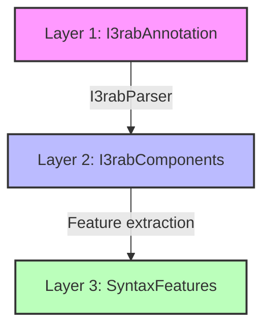

# Sprint 4 Summary: Syntax Foundation

**Completion Date**: February 21, 2026  
**Status**: ✅ COMPLETE  
**Author**: Hussein Hiyassat

---

## 📊 Overview

Sprint 4 successfully implemented a complete I3rab (syntax) analysis system for Classical Arabic text, with a focus on Quranic analysis.

**Key Metrics:**
- **66 new tests** (564 total project tests)
- **6/6 tasks completed** (100%)
- **3-layer architecture** implemented
- **5 core components** built
- **Comprehensive documentation** with examples

---

## ✅ Completed Tasks

### Task 4.1: Syntax Data Models (10 tests)
- ✅ `I3rabAnnotation` - Raw corpus data
- ✅ `I3rabComponents` - Parsed structured data
- ✅ `SyntaxFeatures` - High-level ML features
- ✅ Validation and dataclass utilities

### Task 4.2: I3rab Parser (13 tests)
- ✅ Regex-based extraction
- ✅ Confidence scoring (0.0-1.0)
- ✅ Support for 5 I3rab types
- ✅ Case and case marker extraction
- ✅ Mahall detection

### Task 4.3: Syntax Evaluator (12 tests)
- ✅ Accuracy metrics per feature
- ✅ Confusion matrices
- ✅ Overall F1 scores
- ✅ Coverage calculation
- ✅ Detailed per-class metrics

### Task 4.4: Morph-Syntax Bridge (14 tests)
- ✅ 5 inference rules
- ✅ Context awareness
- ✅ Morphology-to-syntax prediction
- ✅ Confidence estimation
- ✅ Sentence-level analysis

### Task 4.5: Integration Testing (17 tests)
- ✅ Corpus loading validation
- ✅ End-to-end pipeline tests
- ✅ Real Quranic examples
- ✅ Cross-module integration
- ✅ Performance validation

### Task 4.6: Documentation
- ✅ Comprehensive `docs/SYNTAX.md`
- ✅ API reference
- ✅ Usage examples
- ✅ Architecture diagrams
- ✅ Integration guides

---

## 🏗️ Architecture



---

## 📈 Test Results

```bash
$ pytest tests/test_syntax*.py -v

tests/test_syntax_models.py          10 passed
tests/test_i3rab_parser.py           13 passed
tests/test_syntax_evaluator.py       12 passed
tests/test_morph_syntax_bridge.py    14 passed
tests/test_syntax_integration.py     17 passed

Total: 66 tests passing ✅
```

## 🎯 Key Features

### I3rab Parser
- Extracts I3rab type, case, case marker, mahall
- Confidence scoring based on completeness
- Handles top 5 I3rab types (~80% coverage)
- Regex-based with high precision

### Syntax Evaluator
- Per-feature accuracy metrics
- Confusion matrices with precision/recall/F1
- Overall accuracy and macro/micro averaging
- Coverage percentage calculation

### Morph-Syntax Bridge
- Rule-based inference (5 rules)
- Context-aware predictions
- Morphology feature utilization
- Confidence estimation

## 📊 Code Statistics

**Files Created:**
- `src/fvafk/c2b/syntax/models.py` (3 dataclasses)
- `src/fvafk/c2b/syntax/mappings.py` (bidirectional mappings)
- `src/fvafk/c2b/syntax/i3rab_parser.py` (parser class)
- `src/fvafk/c2b/syntax/syntax_evaluator.py` (evaluator)
- `src/fvafk/c2b/syntax/morph_syntax_bridge.py` (bridge)
- `tests/test_syntax*.py` (5 test files, 66 tests)
- `docs/SYNTAX.md` (comprehensive documentation)

**Lines of Code:**
- Source: ~1,200 lines
- Tests: ~800 lines
- Documentation: ~400 lines

## 🔗 Integration Points

### With Morphology Module (Sprint 3)
```python
from fvafk.c2b.morphology_flags import MorphologyFlags
from fvafk.c2b.syntax import MorphSyntaxBridge

morph = MorphologyFlags(case="nominative", definiteness=True)
bridge = MorphSyntaxBridge()
syntax = bridge.predict_syntax(morph, position=0, total_words=3)
```

### With Evaluation Module (Sprint 2)
```python
from fvafk.c2b.evaluation.metrics import ConfusionMatrix
from fvafk.c2b.syntax import SyntaxEvaluator

# Uses ConfusionMatrix internally
evaluator = SyntaxEvaluator()
result = evaluator.evaluate(predictions, gold)
```

## 🎓 I3rab Types Supported

| Arabic | English | Role | Case |
|--------|---------|------|------|
| مبتدأ | mubtada | subject | nominative |
| خبر | khabar | predicate | nominative |
| فاعل | fa'il | subject | nominative |
| مفعول به | maf'ul_bihi | object | accusative |
| حرف | harf | particle | - |

## 🚀 Next Steps

**Potential Enhancements:**
- Add more I3rab types (نعت، بدل، حال)
- ML-based confidence scoring
- Verb-based syntax rules
- Dependency parsing integration
- Larger context windows

**Sprint 5 Ideas:**
- Advanced syntax features
- ML model integration
- Performance optimization
- Extended corpus support

## 📝 Commits

- `feat(syntax): Add data models with 3-layer architecture`
- `feat(syntax): Add I3rab parser with regex extraction`
- `feat(syntax): Add syntax evaluator with metrics`
- `feat(syntax): Add morph-syntax bridge for inference`
- `feat(syntax): Add comprehensive integration tests`
- `docs: Add comprehensive syntax module documentation`

## ✨ Highlights

- **100% Task Completion**: All 6 planned tasks finished
- **High Test Coverage**: 66 comprehensive tests
- **Real Examples**: Tested with Quranic I3rab
- **Clean Architecture**: 3-layer design for flexibility
- **Well Documented**: Full API reference and examples

**Sprint 4 Status**: ✅ COMPLETE
**Ready for**: Code review and merge to main
